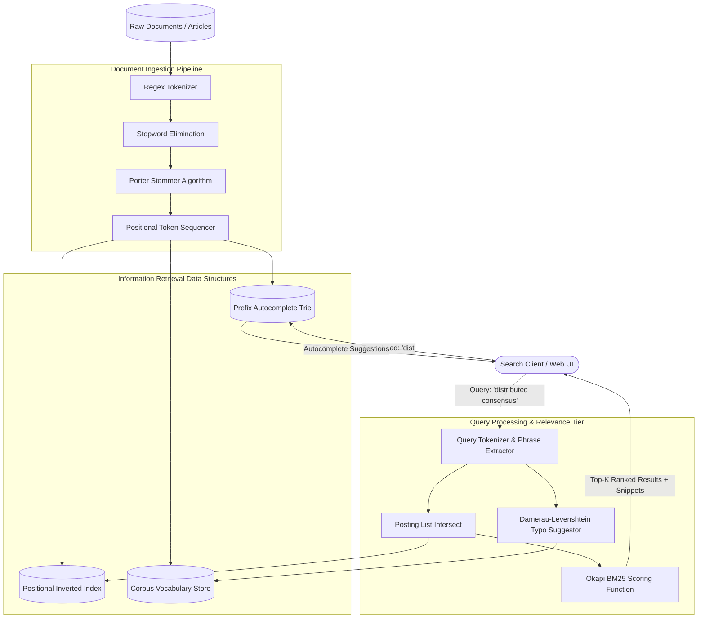

# System Architecture & Technical Design

## 1. High-Level Architecture Overview

The **Mini Search Engine** implements classic information retrieval principles modeled after the architecture of Apache Lucene and Elasticsearch.

---

## 2. Inverted Index with Positional Postings

### Why Simple Word-to-Doc Maps Fail
A naive inverted index stores only document IDs:
`"consensus" -> [doc1, doc2]`

This structure makes it mathematically impossible to execute **Exact Phrase Queries** (e.g., `"distributed consensus"`) without performing expensive linear regex re-scans over the raw text of every matching document.

### The Positional Posting Model
Our engine stores term frequencies alongside exact word offsets:

$$\text{Term} \longrightarrow \left\{ \text{DocID}: \text{Posting}(\text{tf}, [p_0, p_1, \dots, p_k]) \right\}$$

When querying `"distributed consensus"`:
1. Candidate documents must contain both `distributed` and `consensus`.
2. The engine checks if $\exists p \in \text{positions}(\text{distributed})$ such that $p + 1 \in \text{positions}(\text{consensus})$.
3. Phrase verification executes in $O(P_1 + P_2)$ linear time over the postings rather than scanning megabytes of raw text.

---

## 3. Okapi BM25 Ranking vs. Naive TF-IDF

### Term Frequency Saturation ($k_1 = 1.5$)
In classic TF-IDF, a document mentioning a term 100 times scores $10\times$ higher than a document mentioning it 10 times. In real-world search, a word's relevance saturates quickly. BM25 uses an asymptotic hyperbola:

$$\frac{f(q_i, D) \cdot (k_1 + 1)}{f(q_i, D) + k_1}$$

As term frequency $f(q_i, D) \to \infty$, the multiplier approaches $k_1 + 1$, preventing keyword-stuffed documents from dominating the ranking.

### Document Length Normalization ($b = 0.75$)
Longer documents naturally contain more words. Without normalization, an encyclopedia article would always outrank a concise, highly focused blog post. BM25 scales term frequency by the ratio of document length to the average corpus document length:

$$B = 1 - b + b \cdot \left(\frac{|D|}{\text{avgdl}}\right)$$

If $|D| > \text{avgdl}$, the denominator increases, softening the score. If $|D| < \text{avgdl}$, the term is given higher weight.

---

## 4. Prefix Trie & Damerau-Levenshtein Typo Correction

- **Prefix Trie:** Traverses characters in $O(L)$ time (where $L$ is prefix length). Sub-branches are DFS-traversed and sorted by corpus term frequency to serve instant search-as-you-type suggestions.
- **Damerau-Levenshtein:** Dynamic programming algorithm computing minimum edit distance across insertions, deletions, substitutions, and character transpositions to suggest corrections for misspelled queries (e.g., "distrubuted" $\to$ "distributed").
